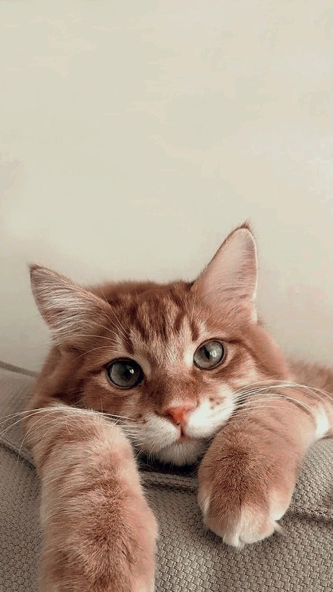
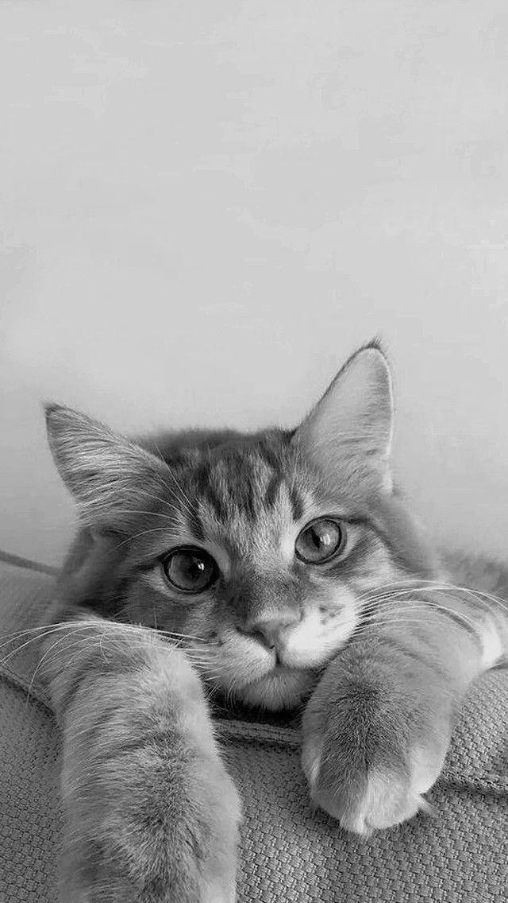
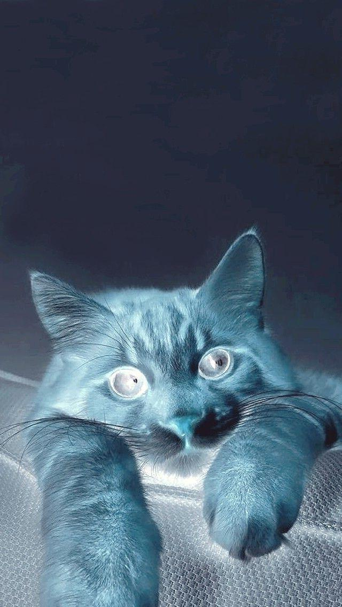
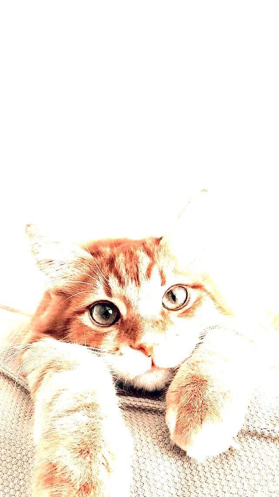

# Image transformation minute project
Here are the results of applying the transformations to an example image:

### Original Image

### 1. Grayscale Conversion

    New R = (R + G + B)/3
    New G = (R + G + B)/3
    New B = (R + G + B)/3

### 2. Color Inversion

    New R = 255 - R
    New G = 255 - G
    New B = 255 - B

### 3. Brightness Adjustment

    New R = R * level
    New G = G * level
    New B = B * level